# Introduction

Traffic congestion and incidents are significant challenges many businesses face in the United Kingdom (Mall et al., 2023). One of the factors that have led to this is the recent growth in urban population, inadequate road capacity, and geographical factors (Bosona, 2020).

This study examines information gathered from sensors placed along the M1 highways. Various statistical techniques are used to shed light on the relationships between the variables in the dataset collected, which contains real-time information regarding traffic conditions, such as speeds at various times of the day. Several visualisations, including boxplot, scatterplot, and histogram, are presented to do this and comprehend this data's distribution.

This study uses the stratified random sampling technique, which categorises components of a population (traffic data) into smaller groups (Zhang et al., 2022).

# Research Methodology and Design

## Data Collection

The data was collected for a period spanning over three weeks (March 20th to April 9th, 2023) from the Traffic England website. The data was collected in three different morning, afternoon, and night strata. The data collected amounted to 54 observations in each Excel sheet and 3,402 observations overall.

## Research Hypothesis

- There is a considerable variation in average speed depending on the time of the day.
- The day of the week determines the average speed on the M1 motorway.

## Research Questions

- Is the time of the day a factor that affects the average speed on the motorway?
- What are the other factors that affect the average speed on the motorway?

## Sampling Methodology

The sampling methodology utilised is the stratified random sampling method. At every point of analysis, the sampling size was decided using the expression below:
Sample size = ((z^2 * p * (1 - p)) / e^2) / (1 + (z^2 * p * (1 - p)) / (N * e^2))
(Sharma et al., 2020)

Where:  
- `N` = population size  
- `e` = margin of error  
- `z` = z-score  
- `P` = population proportion  

The desired confidence level is 95%; this means that 95% of the time, the actual population is expected to be acquired (Eridon and Mishler, 2020). This consequently means that the margin of error is 5% or 0.05, representing the degree of uncertainty in the sampling (Eridon and Mishler, 2020). The z-score corresponding to 0.95 in the standard typical distribution table is 1.96.

The default sample size can be calculated by:
Sample size = ((z^2 * p * (1 - p)) / e^2) / (1 + (z^2 * p * (1 - p)) / (N * e^2))
= ((1.96^2 * 0.5 * (1 - 0.5)) / 0.05^2) / (1 + (1.96^2 * 0.5 * (1 - 0.5)) / (3402 * 0.05^2))
= 384.16 / 1.11
= 346

This means that a total of 346 samples, which contain an equal number of samples from each stratum, will be randomly selected from the total data.

# Data Description

## Libraries Import

The following libraries and packages were imported:

## Importing the Dataset

21 `.xlsx` data files were imported using the `read_excel` function. The datasets were bound together using the `bind()` function. The data was stored in the `dataset` variable containing 3,402 observations and 332 columns.

## Relevant Features Selection

The dataset was critically examined, and 27 of the 332 columns were selected and renamed appropriately. A new column showing the weekdays was created in the process, making 28 columns. A glimpse of the dataset before and after renaming is shown below:

# Data Pre-processing

## Checking for Duplicate Samples

The data was found to be without any duplicate observations.

## Checking and Handling Missingness

2,773 data points were found missing in the data. The median values of the numerical variables were used to replace all the missing data points in their respective columns. The remaining missing data points were replaced with "Unknown". Hence, all the data points were accounted for.

The non-numerical features were converted to factors because it makes characterising vectors in a non-alphabetical order possible.

# Exploratory Data Analysis

A correlation matrix of all the numerical variables consisting of the length of M1 motorway roads and average speeds is visualised below:

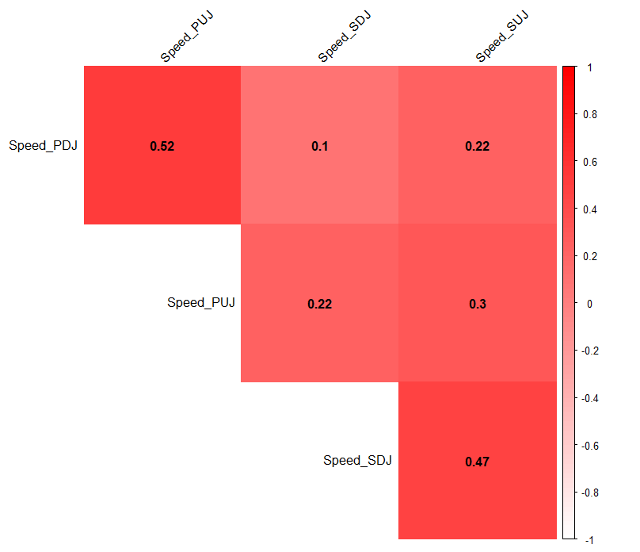

No strong correlation was found, except in `Length_PUJ0` and `Length_SDJ0`, with a moderate positive correlation.

Also, a correlation matrix between the average speeds is visualised below:

The following visualisations show the data distributions of different road sections of M1 motorways:

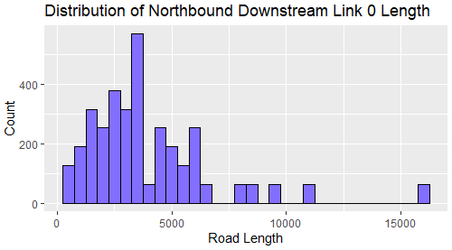  
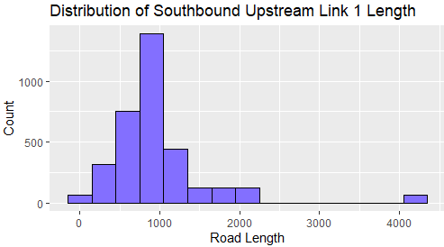  
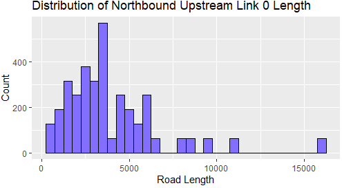  
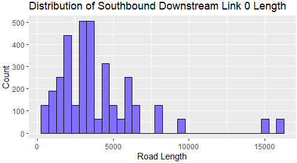

From the boxplots, there is the presence of outliers in the length of different road networks.

The distribution of the length of the roads can better be described by the visualisations below:

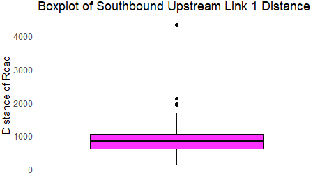

The histograms show that the distribution of the length of the roads is right-skewed because they are clustered more to the left side of the x-axis. This means that the mean is greater than the median in the length distributions of southbound and northbound roads.

## Average Speed Along Northbound and Southbound City Sections

From the graph above, the average speed in the Northbound section is higher in Huddersfield, Loughborough, and Wakefield and lowest in Manchester/Hull and Hemel Hempstead. While in the Southbound sections, the average speed seems evenly distributed except for some low points such as Dunstable and Luton.

# Data Analysis by Sampling

## Sampling by Day of the Week

As suggested by Mishra et al. (2019), it may be necessary to make approximations with sample sizes to make an even sample distribution between each stratum. The sample size of 346 will be approximated to 350 to distribute the seven days of the week evenly. Since the whole data contains an equal number of days in a week, 50 rows of data were randomly selected from each day of the week (stratum) with a seed set to 42.

### Boxplots of Speed by Day of the Week on Each of the Motorway Lanes

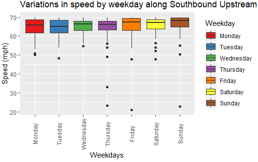  
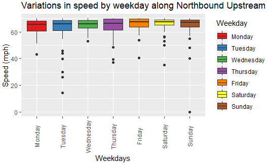

From the boxplots, it can be seen that the speed tends to increase towards the end of the week. The average speed is found to be lowest on Tuesday, Wednesday, and Thursday along the Southbound lane and on the high side on Friday, Saturday, and Sunday. The same pattern also applied to the Northbound lanes. However, the highest average speed was recorded on Saturday.

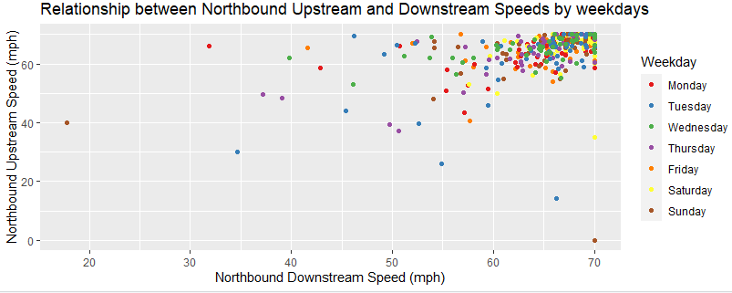  
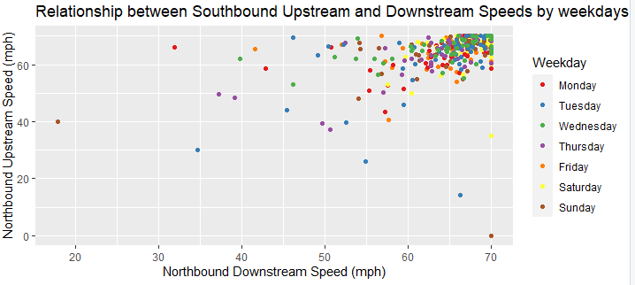

## Sampling by Daytime

This time, the sample size will be rounded up to 348 to allow for even division within the stratum.

The boxplots above show that the average speed is higher in the afternoon than in the morning or nighttime. There are lower speeds recorded in the morning along the Northbound downstream lane.

## Sampling by Date Type

The sampling this time was done with a sampling size of 357, which is the closest to the initial sampling size, which can give an even division. Fifty-one data samples were randomly allocated to each day of the week, such that weekdays had 255 samples and weekends had 102 samples.

In all the boxplots, it is evident that the average speed in all the road lanes is higher on the weekends; this could be because traffic congestion is usually less during weekends and road construction usually takes place during the weekdays.

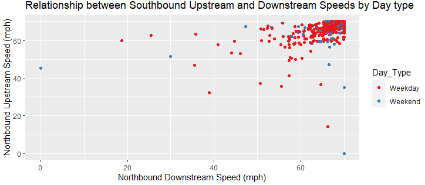  
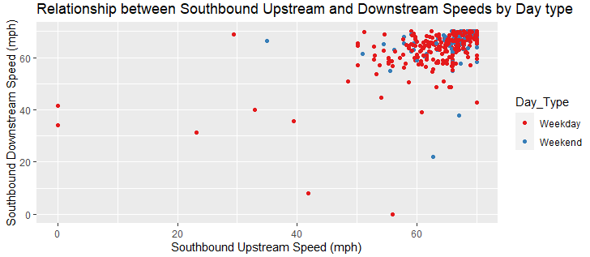

From the diagram above, most data points are clustered around the right-hand corner.

## Sampling by Daytime (Repeated Section)

It will be reasonable to make the sample size 357, which is the closest number to ensure even sample distribution (21 days).

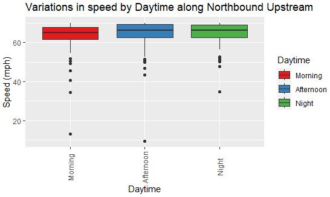  
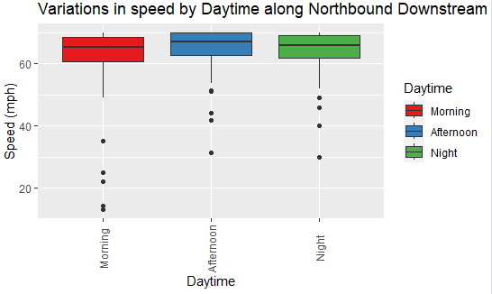

It is essential to note that April 9th has a considerably high median. This could be because it is Easter Sunday, and there is likely minimal road congestion.

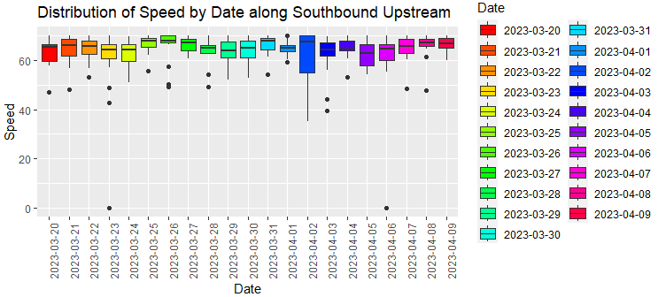

## Hypothesis Testing

The first hypothesis suggests a difference in the average speed depending on the time of the day. The null hypothesis is that there is no difference. The t-test is performed with a significance value of 0.05.

The second hypothesis states that the week determines the average speed on the motorway. The null hypothesis states that the average speed is not impacted by the week's time. The t-test is also done with a significance level of 0.05.

# Discussion of Findings

The average speed is influenced by the day and the period of the week. Generally, traffic situations are better during the weekends than during the weekdays. This could be because people are not usually commuting to work at the weekends, and there are less likely to be road repairs at the weekends.

# Recommendation

The customer needs to plan their deliveries accordingly to avoid moments of severe traffic, which generally occur in the morning and evenings on weekdays. To plan their deliveries, the customer should also consider utilising state-of-the-art technologies such as GPS tracking and traffic optimisation applications. Policymakers should consider spending on road infrastructures that can improve traffic conditions.

# Conclusion

A Stratified Random Sampling approach was implemented in this study to analyse the data of the M1 motorway. The mean speed on the motorway was found to be 64.07 mph. Several factors contribute to the average speed and traffic congestion, such as the period of the day, part of the week, and government policies that align with previous research. This study will enable business owners, road users, and policymakers to decide how to enhance logistics and traffic circumstances.

