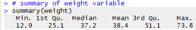
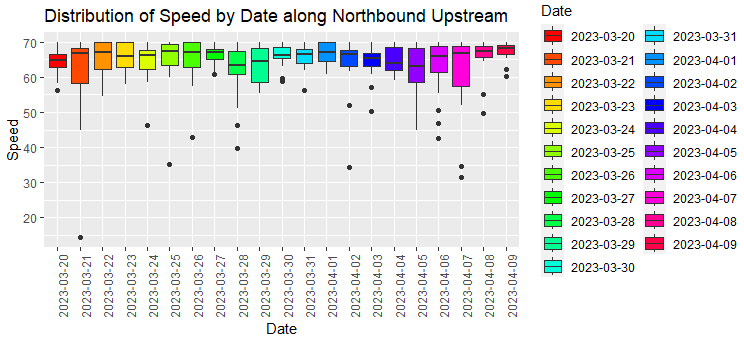
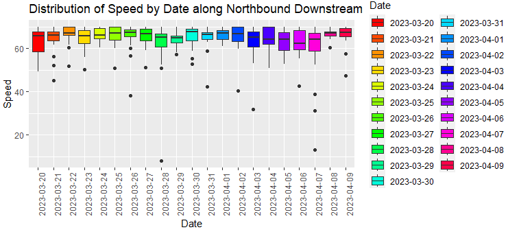

# M1 Motorway Traffic Analysis using R

## Question 10: Full Data Science Workflow — M1 Motorway

### Introduction
Traffic congestion and incidents are significant challenges many businesses face in the United Kingdom (Mall et al., 2023). One of the factors that have led to this is the recent growth in urban population, inadequate road capacity, and geographical factors (Bosona, 2020).

This study examines information gathered from sensors placed along the M1 highways. Various statistical techniques are used to shed light on the relationships between the variables in the dataset collected, which contains real-time information regarding traffic conditions, such as speeds at various times of the day. Several visualisations, including boxplot, scatterplot, and histogram, are presented to help comprehend the data's distribution.

Stratified random sampling was used to break the traffic data into meaningful subsets (Zhang et al., 2022).

---

### Literature Review
- **Loo and Huang (2022)** and **Rahman et al. (2022)** identify factors like population density, per capita income, and employment concentration as major contributors to congestion.
- **Sun and Lu (2022)** showed governance policies have a stronger effect on reducing congestion than socioeconomic factors.

---

### Methodology

#### Data Collection
- Period: March 20th to April 9th, 2023
- Source: Traffic England
- Observations: 3402
- Format: 21 Excel files (morning, afternoon, night strata)

#### Hypotheses
1. Time of day affects average traffic speed.
2. Weekday affects average traffic speed.

#### Sampling Strategy
- **Stratified random sampling** was used.
- Desired confidence: 95%
- Margin of error: 5%
- Resulting sample size ≈ 346

```r
# Sample size formula
n = (z^2 * p * (1-p)) / e^2
# where z = 1.96, e = 0.05, p = 0.5 (default)
```

---

### Data Cleaning and Pre-processing
- **Merged** 21 Excel files using `read_excel()` and `bind_rows()`
- Selected **28 relevant columns** (from 332)
- **Created new columns** like Weekday
- Handled 2773 missing values:
  - Numeric: Imputed using median
  - Categorical: Replaced with `"Unknown"`
- Converted characters to factors

---

### Exploratory Data Analysis (EDA)

#### Correlation Matrix (Numerical Columns)
- Weak to moderate correlations across variables
- Moderate correlation between Length_PUJ0 and Length_SDJ0

#### Boxplots (Outliers in Road Length)


#### Histograms (Length Distribution)


#### Average Speeds — Northbound vs Southbound


---

### Stratified Sampling and Visualisation

- Sampled data based on strata:
  - Day type (Weekday/Weekend)
  - Time of day (Morning/Afternoon/Night)
- Boxplots show:
  - Higher speed during weekends
  - Afternoon periods had smoothest traffic across all lanes

---

### Hypothesis Testing

#### T-test Results
- **Speed differs significantly by Day Type**
- **Speed differs significantly by Time of Day**
- P-values < 0.05 → Statistically significant differences

---

### Key Insights
- **Weekend traffic speeds were consistently higher**
- **Afternoon periods recorded smoother flow**
- **Length alone wasn’t a strong predictor of speed**

---

### Tools Used
- **Language**: R
- **Packages**: `tidyverse`, `ggplot2`, `readxl`, `dplyr`, `corrplot`, `naniar`, `stats`

---

### Files Included
- `/scripts`: Data import, cleaning, EDA, and hypothesis testing
- `/outputs`: Figures, charts, and summary stats
- `/report`: Full project write-up (DOCX)

---

### References
Sun & Lu (2022), Mall et al. (2023), Loo & Huang (2022), Rahman et al. (2022), Zhang et al. (2022)

---

> 🧠 This project simulates a real-world statistical data analysis workflow using R and is useful for transport planning, policy research, and infrastructure optimization.